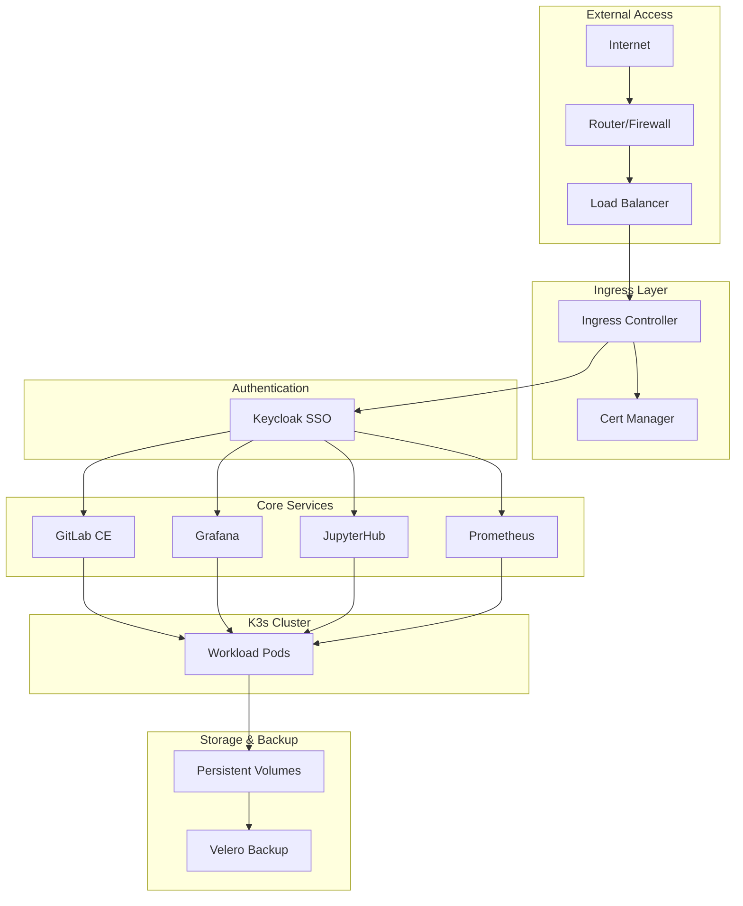

# Zero Trust AI R&D Infrastructure

[](https://choosealicense.com/licenses/mit/)
[](https://kubernetes.io/)
[](https://gitlab.com/)
[](https://terraform.io/)

A production-ready, Zero Trust Architecture homelab infrastructure for AI/ML R&D workflows. Features GitLab, K3s, SSO authentication, comprehensive monitoring, and automated certificate management.

## 🏗️ Architecture Overview



## ✨ Features

- **🔐 Zero Trust Security**: Network policies, mTLS, RBAC with least privilege
- **🔑 Centralized SSO**: Keycloak integration across all services
- **📊 Full Observability**: Prometheus, Grafana, Loki logging stack
- **🤖 AI/ML Platform**: JupyterHub with GPU support and MLflow tracking
- **🚀 GitOps Ready**: ArgoCD for automated deployments
- **📜 Certificate Automation**: Let's Encrypt + self-signed fallback
- **🔄 CI/CD Pipeline**: Multi-stage GitLab pipeline with security scanning
- **💾 Backup & Recovery**: Velero automated backups
- **⚙️ Infrastructure as Code**: Terraform + Ansible automation

## 🛠️ Technology Stack

| Component | Technology | Version | Purpose |
|-----------|------------|---------|---------|
| **Container Runtime** | K3s | v1.28.5 | Lightweight Kubernetes |
| **Authentication** | Keycloak | 23.0.0 | SSO & Identity Management |
| **Source Control** | GitLab CE | 16.6.0 | Git repositories & CI/CD |
| **Monitoring** | Prometheus + Grafana | 55.0.0 | Metrics & Visualization |
| **AI/ML Platform** | JupyterHub | 3.1.0 | Notebook environment |
| **Certificate Management** | Cert-Manager | v1.13.0 | TLS automation |
| **Ingress** | Ingress-NGINX | 4.8.0 | Load balancing |
| **GitOps** | ArgoCD | 5.51.0 | Deployment automation |
| **Backup** | Velero | 5.1.0 | Disaster recovery |

## 🚀 Quick Start

### Prerequisites

- Debian 12.11 server with 4GB+ RAM, 20GB+ storage
- Docker and docker-compose
- kubectl and helm
- Root access

### 1. Download & Extract

```bash
# Download latest release
wget https://github.com/tzervas/homelab-ai-rnd-stack/releases/latest/download/homelab-installer.tar.gz

# Extract installer
tar -xzf homelab-installer.tar.gz
cd homelab-installer
```

### 2. Configure

```bash
# Edit configuration
nano config/installer.conf

# Key settings:
# DOMAIN_NAME="homelab.local"
# USE_LETSENCRYPT="false"
# ACME_EMAIL="admin@homelab.local"
```

### 3. Deploy

```bash
# Run automated installer
sudo ./install.sh

# Installation takes 10-15 minutes
# Access info saved to ~/homelab-access-info.md
```

### 4. Access Services

Add DNS entries to `/etc/hosts` or router:

```
192.168.1.100  gitlab.homelab.local
192.168.1.100  keycloak.homelab.local  
192.168.1.100  grafana.homelab.local
192.168.1.100  jupyter.homelab.local
```

Default credentials in `~/homelab-access-info.md`.

## 📁 Project Structure

```
homelab-zta/
├── terraform/              # Infrastructure as Code
├── ansible/                # Configuration management
├── charts/                 # Helm chart dependencies  
├── overrides/              # 3-tier configuration system
│   ├── global/            # Environment configs
│   ├── release/           # Chart versions
│   └── service/           # Service-specific
├── k8s-manifests/         # Kubernetes resources
├── scripts/               # Automation tools
├── .gitlab-ci.yml         # CI/CD pipeline
└── docs/                  # Documentation
```

## ⚙️ Configuration System

### 3-Tier Override Hierarchy

1. **Global**: `overrides/global/config.yaml` - Environment-wide settings
2. **Release**: `overrides/release/` - Chart versions and policies  
3. **Service**: `overrides/service/{service}/` - Component customizations

Example global config:

```yaml
global:
  domain_name: "homelab.local"
  certificates:
    use_letsencrypt: false
  resources:
    default_profile: "medium"
  monitoring:
    retention: "30d"
```

### Environment Deployment

```bash
# Production
bash scripts/deploy/deploy-stack.sh production

# Staging  
bash scripts/deploy/deploy-stack.sh staging

# Development
bash scripts/deploy/deploy-stack.sh development
```

## 🔐 Security Features

- **Network Policies**: Default-deny with explicit allow rules
- **RBAC**: Multi-tier user system (admin, kang, developers, viewers)
- **Certificate Management**: Automated TLS with renewal
- **Secret Management**: External Secrets Operator integration
- **Security Scanning**: SAST, container, and secret detection in CI/CD

### User Accounts

| User | Access Level | Purpose |
|------|-------------|---------|
| `admin` | Full cluster admin | System administration |
| `kang` | Admin-lite DevOps | Daily operations |
| `developers` | Limited namespace access | Development work |
| `viewers` | Read-only monitoring | Observability |

## 📊 Monitoring & Observability

- **Metrics**: Prometheus with 30+ day retention
- **Visualization**: Grafana dashboards for all services
- **Logging**: Loki centralized log aggregation
- **Alerting**: AlertManager with email/Slack notifications
- **Health Checks**: Automated service monitoring

Access Grafana at `https://grafana.homelab.local` (admin credentials in access info).

## 🤖 AI/ML Platform

- **JupyterHub**: Multi-user notebook environment
- **GPU Support**: NVIDIA container runtime integration
- **MLflow**: Experiment tracking and model registry
- **Resource Management**: CPU/memory quotas per user
- **Authentication**: SSO integration with Keycloak

## 🔄 CI/CD Pipeline

5-stage GitLab pipeline:

1. **Validate**: Terraform/Ansible linting, security scans
2. **Build**: Container images, Helm charts, installers
3. **Test**: Integration tests, security validation
4. **Deploy**: Staging (auto) → Production (manual)
5. **Monitor**: Health checks, performance tests

## 📚 Documentation

- **Project Charter**: [Confluence](https://vectorweighttech.atlassian.net/wiki/spaces/HARS/pages/66487)
- **Implementation Guide**: [Confluence](https://vectorweighttech.atlassian.net/wiki/spaces/HARS/pages/66518)
- **CI/CD Architecture**: [Confluence](https://vectorweighttech.atlassian.net/wiki/spaces/HARS/pages/98333)
- **Troubleshooting**: [Confluence](https://vectorweighttech.atlassian.net/wiki/spaces/HARS/pages/66558)
- **Project Tracking**: [Jira Epic CCS-30](https://vectorweighttech.atlassian.net/browse/CCS-30)

## 🛠️ Development

### Setup Development Environment

```bash
# Clone repository
git clone https://github.com/tzervas/homelab-ai-rnd-stack.git
cd homelab-zta

# Setup FOSS chart dependencies
bash scripts/setup-foss-dependencies.sh

# Validate configuration
bash scripts/validate/validate-overrides.sh

# Deploy to development
bash scripts/deploy/deploy-stack.sh development
```

### Chart Management

```bash
# Check for updates
bash scripts/update/check-updates.sh

# Update dependencies  
bash scripts/update/update-charts.sh

# Render manifests
bash scripts/deploy/render-manifests.sh production
```

## 🤝 Contributing

1. Fork the repository
2. Create feature branch (`git checkout -b feature/amazing-feature`)
3. Commit changes (`git commit -m 'Add amazing feature'`)
4. Push to branch (`git push origin feature/amazing-feature`)
5. Open Pull Request

### Development Guidelines

- Follow infrastructure as code best practices
- Update documentation for new features
- Test in development environment first
- Ensure security scanning passes
- Update override configurations appropriately

## 📋 Roadmap

- [ ] Multi-node K3s cluster support
- [ ] HashiCorp Vault integration
- [ ] Advanced AI/ML workflows (Kubeflow)
- [ ] Multi-cloud backup strategies
- [ ] Enhanced monitoring dashboards
- [ ] Automated compliance reporting

See [GitHub Projects](https://github.com/users/tzervas/projects/4) for detailed tracking.

## 🆘 Support

### Common Issues

**GitLab won't start**: Check container logs with `docker logs gitlab`
**Certificate errors**: Verify DNS configuration and Let's Encrypt setup
**K3s cluster issues**: Check node status with `kubectl get nodes`

Full troubleshooting guide: [Confluence](https://vectorweighttech.atlassian.net/wiki/spaces/HARS/pages/66558)

### Getting Help

- **Issues**: [GitHub Issues](https://github.com/tzervas/homelab-ai-rnd-stack/issues)
- **Discussions**: [GitHub Discussions](https://github.com/tzervas/homelab-ai-rnd-stack/discussions)
- **Documentation**: [Confluence Space](https://vectorweighttech.atlassian.net/wiki/spaces/HARS)

## 📄 License

This project is licensed under the MIT License - see the [LICENSE](LICENSE) file for details.

## 🙏 Acknowledgments

- [K3s](https://k3s.io/)
- [GitLab](https://gitlab.com/)
- [Keycloak](https://keycloak.org/)
- [Prometheus](https://prometheus.io/)
- [JupyterHub](https://jupyter.org/hub)
