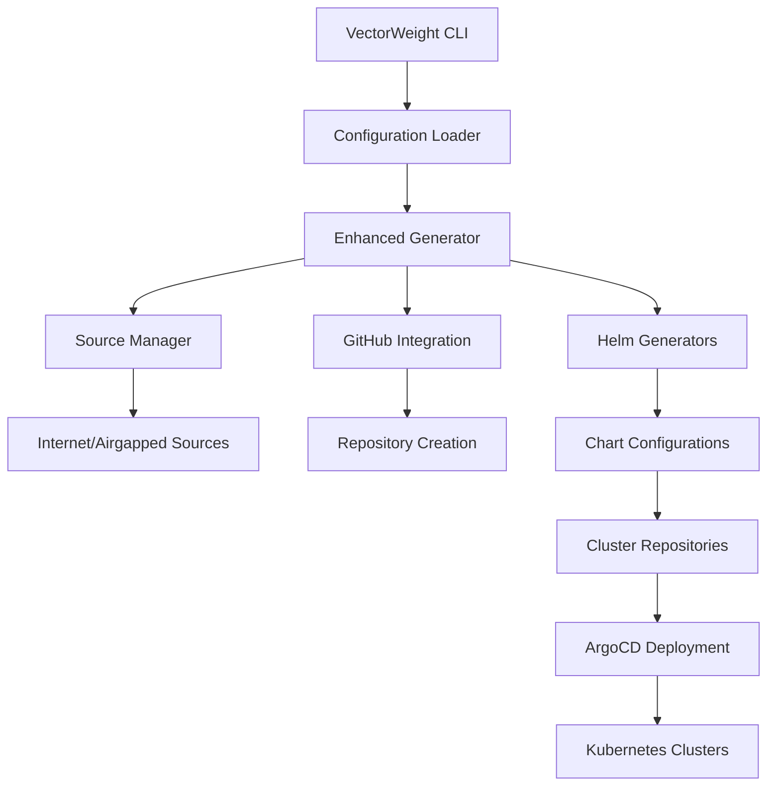

# VectorWeight Homelab - Kubernetes GitOps Automation

[](https://www.python.org/downloads/)
[](https://opensource.org/licenses/MIT)
[](https://github.com/psf/black)

Enterprise-grade Kubernetes GitOps automation framework for AI/ML homelabs with comprehensive deployment modes, vector database integration, and enterprise authorization.

## 🚀 Quick Start

### Installation

```bash
# Install from PyPI (when released)
pip install vectorweight-homelab

# Or install from source
git clone https://github.com/vectorweight/homelab.git
cd homelab
pip install -e .

# Or using UV (recommended for development)
uv sync
```

### Initialize Your First Deployment

```bash
# Create a minimal development configuration
vectorweight init --template minimal_dev --output my-homelab.yaml

# Generate the deployment
vectorweight generate --config my-homelab.yaml

# Deploy to Kubernetes
cd vectorweight-deployment
./deploy.sh
```

## 🌟 Features

### Core Capabilities
- **Multi-Mode Deployment**: Internet, airgapped (VC, local, network, archive)
- **Idempotent Operations**: Smart state management and incremental updates
- **GitOps Native**: ArgoCD-based orchestration with ApplicationSets
- **Auto Repository Management**: GitHub API integration for seamless setup

### AI/ML Specialized
- **Vector Store Integration**: Weaviate, Qdrant, Chroma (persistent & in-memory)
- **GPU Support**: NVIDIA GPU Operator with time-slicing and MIG
- **Model Context Protocol**: MCP server integration for AI agents
- **Authorization Engine**: Cerbos integration for fine-grained access control

### Enterprise Security
- **Zero-Trust Networking**: Cilium CNI with Hubble observability
- **Service Mesh**: Istio with automatic mTLS and policies
- **Pod Security Standards**: Enforced security contexts and policies
- **Network Policies**: Default-deny with explicit allow rules

### Infrastructure
- **Multi-Cluster**: Independent cluster configurations
- **Dynamic Storage**: OpenEBS with multiple storage classes
- **Load Balancing**: MetalLB for bare-metal deployments
- **Monitoring**: Prometheus, Grafana, Loki stack

## 📋 Configuration Examples

### Minimal Development Setup

```yaml
project_name: "my-vectorweight-dev"
environment: "development"
deployment_mode: "internet"

clusters:
  - name: "dev"
    domain: "dev.vectorweight.local"
    size: "minimal"

enable_security_cluster: false
auto_create_repositories: true
```

### Production AI/ML Environment

```yaml
project_name: "vectorweight-production"
environment: "production"
deployment_mode: "internet"

clusters:
  - name: "ai-cluster"
    domain: "ai.vectorweight.com"
    size: "large"
    gpu_enabled: true
    vector_store: "weaviate"
    cerbos_enabled: true
    specialized_workloads:
      - "machine-learning"
      - "ai-inference"

  - name: "security-cluster"
    domain: "sec.vectorweight.com"
    size: "small"
    cerbos_enabled: true
    specialized_workloads:
      - "security"
      - "monitoring"

enable_cerbos_global: true
enable_gpu_operator: true
github_organization: "your-org"
```

### Airgapped Enterprise Deployment

```yaml
project_name: "vectorweight-enterprise"
environment: "production"
deployment_mode: "airgapped-vc"

source:
  mode: "airgapped-vc"
  url: "https://git.internal.company.com/k8s-configs"
  username: "${GIT_USERNAME}"
  token: "${GIT_TOKEN}"

clusters:
  - name: "ai-cluster"
    domain: "ai.internal.company.com"
    size: "large"
    gpu_enabled: true
    vector_store: "weaviate"
    cerbos_enabled: true

auto_create_repositories: false
base_domain: "internal.company.com"
```

## 🏗️ Architecture Overview

### Repository Structure
```
vectorweight-deployment/
├── dev-cluster/                 # Development cluster config
│   ├── infrastructure/          # Infrastructure components
│   │   ├── cilium/             # CNI configuration
│   │   ├── metallb/            # Load balancer
│   │   └── istio/              # Service mesh
│   └── apps/                   # ArgoCD applications
├── ai-cluster/                 # AI/ML cluster config
│   ├── infrastructure/
│   │   ├── weaviate/           # Vector database
│   │   ├── cerbos/             # Authorization
│   │   └── gpu-operator/       # GPU support
│   └── apps/
├── orchestration-repo/         # Central orchestration
│   ├── bootstrap/              # ArgoCD bootstrap
│   └── applicationsets/        # Cluster management
└── deploy.sh                  # Deployment script
```

### Component Flow


## 🔧 Command Line Interface

### Core Commands

```bash
# Initialize new configuration
vectorweight init [OPTIONS]
  --template {minimal_dev,production_full,airgapped_enterprise}
  --interactive          # Interactive wizard
  --output PATH          # Output configuration file

# Generate deployment
vectorweight generate [OPTIONS]
  --config PATH          # Configuration file
  --output PATH          # Output directory
  --dry-run             # Validate only
  --force               # Force regeneration

# Validate configuration
vectorweight validate [OPTIONS]
  --config PATH          # Configuration file
  --detailed            # Show detailed info

# Deploy to Kubernetes
vectorweight deploy [OPTIONS]
  --deployment-dir PATH  # Deployment directory
  --wait                # Wait for completion

# Check deployment status
vectorweight status [OPTIONS]
  --namespace NAME       # ArgoCD namespace

# Show examples
vectorweight examples
  --format {table,json,yaml}
```

### Advanced Usage

```bash
# Environment variable configuration
export GITHUB_TOKEN=ghp_xxxxxxxxxxxx
export GITHUB_ORG=your-organization
export BASE_DOMAIN=your-domain.com

# Interactive configuration wizard
vectorweight init --interactive

# Generate with custom output
vectorweight generate --config prod.yaml --output ./my-deployment

# Validate before deployment
vectorweight validate --config prod.yaml --detailed

# Monitor deployment
vectorweight deploy --deployment-dir ./my-deployment --wait
```

## 🔐 Security Features

### Authorization with Cerbos

VectorWeight integrates Cerbos for fine-grained authorization:

```yaml
# Example policy for vector store access
apiVersion: api.cerbos.dev/v1
resourcePolicy:
  version: "default"
  resource: "vector_store"
  rules:
    - actions: ["read", "query"]
      effect: EFFECT_ALLOW
      roles: ["data-scientist"]
      condition:
        match:
          all:
            of:
              - expr: "request.user.department == 'ai-research'"
              - expr: "request.resource.classification <= 'internal'"
```

### Network Security

- **Default Deny**: All traffic blocked by default
- **Explicit Allow**: Network policies for required communication
- **Service Mesh**: Automatic mTLS between services
- **CNI Security**: Cilium with eBPF for advanced filtering

### Pod Security

- **Security Standards**: Restricted pod security standards
- **Non-Root**: All containers run as non-root users
- **Read-Only**: Read-only root filesystems where possible
- **Capabilities**: Dropped Linux capabilities

## 🤖 AI/ML Integration

### Vector Stores

#### Weaviate (Production)
```yaml
vector_store: "weaviate"
custom_values:
  weaviate:
    replicas: 3
    modules:
      text2vec-transformers:
        enabled: true
      generative-openai:
        enabled: true
```

#### Qdrant (High Performance)
```yaml
vector_store: "qdrant"
custom_values:
  qdrant:
    config:
      cluster:
        enabled: true
      storage:
        performance:
          max_search_threads: 8
```

#### Chroma (Development)
```yaml
vector_store: "chroma-memory"  # In-memory for rapid prototyping
```

### GPU Support

Automatic NVIDIA GPU Operator deployment:

```yaml
gpu_enabled: true
custom_values:
  gpu-operator:
    driver:
      enabled: true
    toolkit:
      enabled: true
    devicePlugin:
      enabled: true
```

### Model Context Protocol (MCP)

Integration with MCP servers for AI agents:

```yaml
enable_mcp: true
# Automatically deploys MCP servers for:
# - GitHub integration
# - Filesystem access
# - Vector store operations
```

## 🌐 Deployment Modes

### Internet Mode (Default)
- Direct Helm repository access
- GitHub repository integration
- Real-time chart updates

### Airgapped Version Control
```yaml
deployment_mode: "airgapped-vc"
source:
  mode: "airgapped-vc"
  url: "https://git.internal.company.com/k8s-configs"
  username: "${GIT_USERNAME}"
  token: "${GIT_TOKEN}"
```

### Airgapped Local
```yaml
deployment_mode: "airgapped-local"
source:
  mode: "airgapped-local"
  path: "/path/to/local/charts"
```

### Airgapped Archive
```yaml
deployment_mode: "airgapped-archive"
source:
  mode: "airgapped-archive"
  path: "/path/to/charts.tar.gz"
  verification_enabled: true
```

## 🔄 Idempotent Operations

VectorWeight ensures idempotent deployments:

- **State Tracking**: Persistent state management
- **Change Detection**: Configuration hash comparison
- **Incremental Updates**: Only modified components updated
- **Rollback Support**: Automatic rollback on failures

## 📊 Monitoring & Observability

### Metrics Stack
- **Prometheus**: Metrics collection and alerting
- **Grafana**: Visualization and dashboards
- **AlertManager**: Alert routing and management

### Logging Stack
- **Loki**: Log aggregation
- **Promtail**: Log collection
- **Grafana**: Log visualization

### Tracing
- **Jaeger**: Distributed tracing
- **Istio Integration**: Automatic trace generation

### Pre-built Dashboards
- Kubernetes cluster overview
- AI workload performance
- Vector store metrics
- Security monitoring
- Compliance reporting

## 🚀 Performance Optimization

### Cluster Sizing

| Size | CPU Cores | Memory | Storage | Use Case |
|------|-----------|---------|---------|----------|
| minimal | 2 | 4GB | 50GB | Development |
| small | 4 | 8GB | 100GB | Testing |
| medium | 8 | 16GB | 250GB | Production |
| large | 16+ | 32GB+ | 500GB+ | Enterprise |

### Resource Optimization
- Automatic resource sizing based on cluster size
- Component co-location for minimal deployments
- High availability for production deployments

## 🧪 Testing

### Unit Tests
```bash
# Run unit tests
pytest tests/unit/

# With coverage
pytest tests/unit/ --cov=vectorweight --cov-report=html
```

### Integration Tests
```bash
# Run integration tests
pytest tests/integration/

# Specific test scenarios
pytest tests/integration/test_deployment.py::TestEndToEndDeployment
```

### Validation Tests
```bash
# Validate configurations
vectorweight validate --config examples/production.yaml --detailed

# Dry run deployment
vectorweight generate --config examples/production.yaml --dry-run
```

## 🤝 Contributing

1. **Fork the repository**
2. **Create feature branch**: `git checkout -b feature/amazing-feature`
3. **Run tests**: `pytest tests/`
4. **Format code**: `black vectorweight/`
5. **Commit changes**: `git commit -m 'Add amazing feature'`
6. **Push branch**: `git push origin feature/amazing-feature`
7. **Open Pull Request**

### Development Setup

```bash
# Clone repository
git clone https://github.com/vectorweight/homelab.git
cd homelab

# Install development dependencies
uv sync --group dev

# Install pre-commit hooks
pre-commit install

# Run tests
pytest tests/
```

## 📚 Documentation

- **API Reference**: [docs/api/](docs/api/)
- **Configuration Guide**: [docs/configuration.md](docs/configuration.md)
- **Deployment Guide**: [docs/deployment.md](docs/deployment.md)
- **Security Guide**: [docs/security.md](docs/security.md)
- **Examples**: [examples/](examples/)

## 🐛 Troubleshooting

### Common Issues

#### GitHub API Rate Limits
```bash
# Use authenticated requests
export GITHUB_TOKEN=your_token_here
```

#### Repository Creation Failures
```bash
# Check GitHub permissions
vectorweight validate --config your-config.yaml

# Manual repository creation
auto_create_repositories: false
```

#### Airgapped Source Issues
```bash
# Verify source accessibility
vectorweight validate --config airgapped-config.yaml --detailed
```

### Debug Mode
```bash
# Enable verbose logging
vectorweight --verbose generate --config your-config.yaml
```

## 📄 License

This project is licensed under the MIT License - see the [LICENSE](LICENSE) file for details.

## 🙏 Acknowledgments

- **ArgoCD** - GitOps continuous delivery
- **Cilium** - eBPF-based networking and security
- **Istio** - Service mesh platform
- **Weaviate** - Vector database
- **Cerbos** - Authorization engine
- **Prometheus** - Monitoring and alerting

## 📞 Support

- **GitHub Issues**: [Report bugs and request features](https://github.com/vectorweight/homelab/issues)
- **Discussions**: [Community discussions](https://github.com/vectorweight/homelab/discussions)
- **Security**: [Security policy](SECURITY.md)

---

**VectorWeight Technologies** - Building the future of AI/ML infrastructure automation