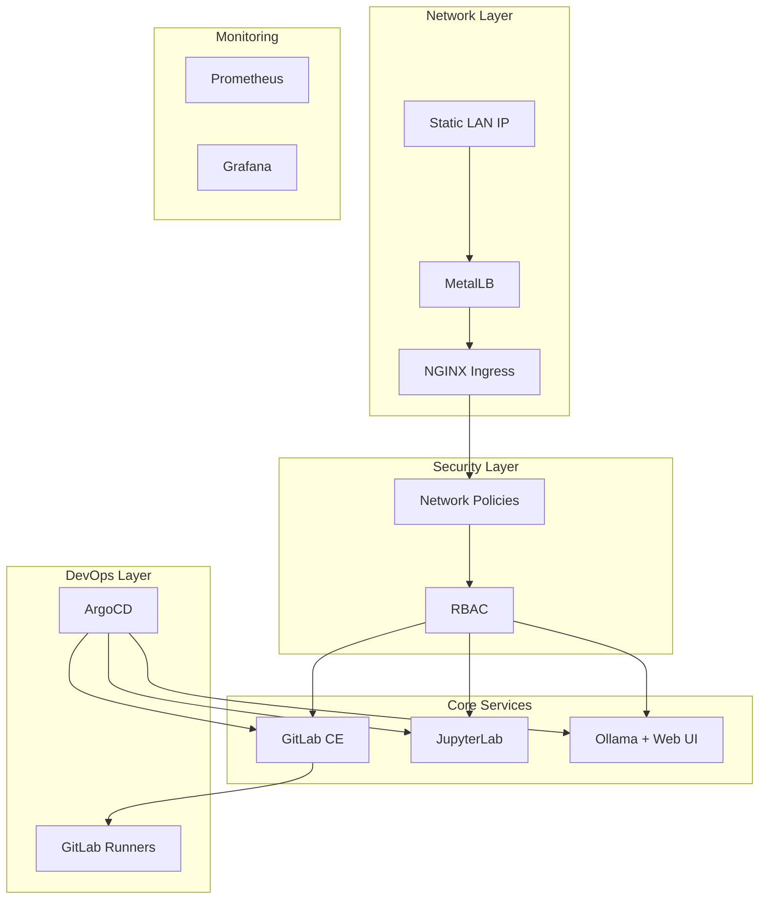
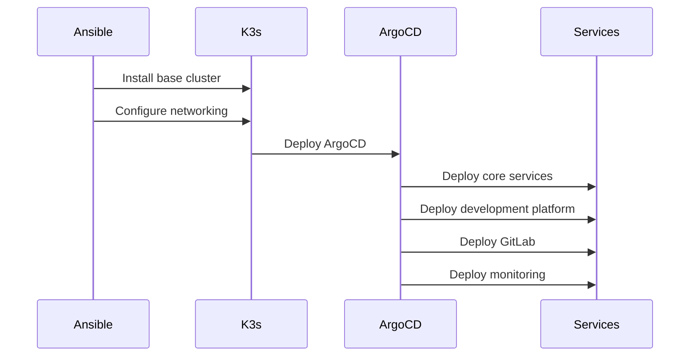

# Homelab AI R&D Stack - Implementation Plan

## Overview
A minimal but robust homelab Kubernetes cluster focused on AI development with GitLab CI/CD capabilities. This implementation prioritizes operability and basic security within a LAN environment.

## Architecture

### Core Components


### Network Architecture
- **Single/Dual Static IP**: All services routed through NGINX Ingress
- **Internal Network**: `10.0.0.0/16` for pod networking
- **Service Network**: `10.1.0.0/16`
- **MetalLB Range**: `192.168.1.200-192.168.1.210` (configurable)

### Components & Responsibilities

#### 1. Base Infrastructure
- **K3s**: Lightweight Kubernetes distribution
- **MetalLB**: Layer 2 load balancer
- **NGINX Ingress**: HTTP/HTTPS routing
- **Cert-Manager**: TLS certificate management
- **ArgoCD**: GitOps deployment

#### 2. Development Environment
- **JupyterLab**:
  - Full Python environment
  - AI/ML package support
  - GPU passthrough support
- **Ollama + Web UI**:
  - Local LLM hosting
  - Web-based interface
  - Model management

#### 3. CI/CD & Version Control
- **GitLab CE**:
  - Source code management
  - CI/CD pipelines
  - Container registry
- **GitLab Runners**:
  - Automated pipeline execution
  - Docker-in-Docker support

#### 4. Monitoring & Security
- **Prometheus**: Metrics collection
- **Grafana**: Visualization
- **Network Policies**: Pod-to-pod security
- **RBAC**: Access control

## Implementation Phases

### Phase 1: Core Infrastructure
1. **K3s Installation**
   - Base cluster setup
   - Container runtime
   - CNI configuration

2. **Load Balancing & Ingress**
   - MetalLB deployment
   - NGINX Ingress controller
   - Basic TLS setup

### Phase 2: Development Platform
1. **JupyterLab Deployment**
   - Base installation
   - GPU support configuration
   - Persistent storage

2. **Ollama Setup**
   - Core installation
   - Web UI deployment
   - Model management

### Phase 3: GitLab & CI/CD
1. **GitLab CE Installation**
   - Core server setup
   - Runner configuration
   - Storage configuration

2. **CI/CD Setup**
   - Pipeline templates
   - Runner registration
   - Repository setup

### Phase 4: Monitoring & Security
1. **Observability Stack**
   - Prometheus deployment
   - Grafana setup
   - Basic dashboards

2. **Security Configuration**
   - Network policies
   - RBAC setup
   - Security context constraints

## Configuration Management

### Directory Structure
```
homelab-ai-rnd-stack/
├── charts/                    # Helm chart dependencies
├── deployments/               # ArgoCD deployment manifests
│   ├── core/                 # Core infrastructure
│   ├── dev/                  # Development tools
│   ├── gitlab/              # GitLab and runners
│   └── monitoring/          # Observability stack
├── templates/                 # Configuration templates
└── overrides/                # Value overrides
    ├── global/              # Global variables
    └── components/          # Component-specific
```

### Configuration Hierarchy
1. **Global Values**: Common settings, network configs
2. **Component Values**: Service-specific configurations
3. **Environment Overrides**: Environment-specific adjustments

## Deployment Flow


## Security Considerations

### Network Security
- Default deny network policies
- Service-to-service authentication
- Ingress TLS termination
- Limited external access

### Access Control
- RBAC for cluster access
- Service account restrictions
- Minimal privileges principle
- Pod security policies

### Infrastructure Security
- Container image scanning
- Resource limitations
- Node security hardening
- Secure communication channels

## Backup & Recovery

### Critical Components
- GitLab repositories & data
- JupyterLab user data
- Persistent volumes
- Configuration data

### Backup Strategies
- Automated backups via cronjobs
- External volume snapshots
- Configuration backups in Git
- Disaster recovery procedures

## Maintenance & Updates

### Regular Maintenance
- Component version updates
- Security patch application
- Performance monitoring
- Health checks

### Update Strategy
- Staging environment testing
- Rolling updates
- Backup before updates
- Rollback procedures

## Success Criteria

### Functional Requirements
- [ ] All services accessible via single/dual IP
- [ ] JupyterLab fully functional with AI support
- [ ] GitLab CI/CD operational
- [ ] Ollama serving models successfully
- [ ] ArgoCD managing deployments

### Performance Requirements
- [ ] Service startup < 5 minutes
- [ ] CI/CD pipeline execution < 10 minutes
- [ ] Web UI response time < 2 seconds
- [ ] Resource usage within limits

### Security Requirements
- [ ] All traffic TLS encrypted
- [ ] Network policies enforced
- [ ] RBAC properly configured
- [ ] No critical security findings

## Future Enhancements

### Phase 5: Advanced Features
- GPU scheduling optimization
- Advanced monitoring alerts
- Backup automation
- High availability options

### Phase 6: Integration
- External authentication
- S3 backup integration
- CI/CD pipeline templates
- Custom dashboards
